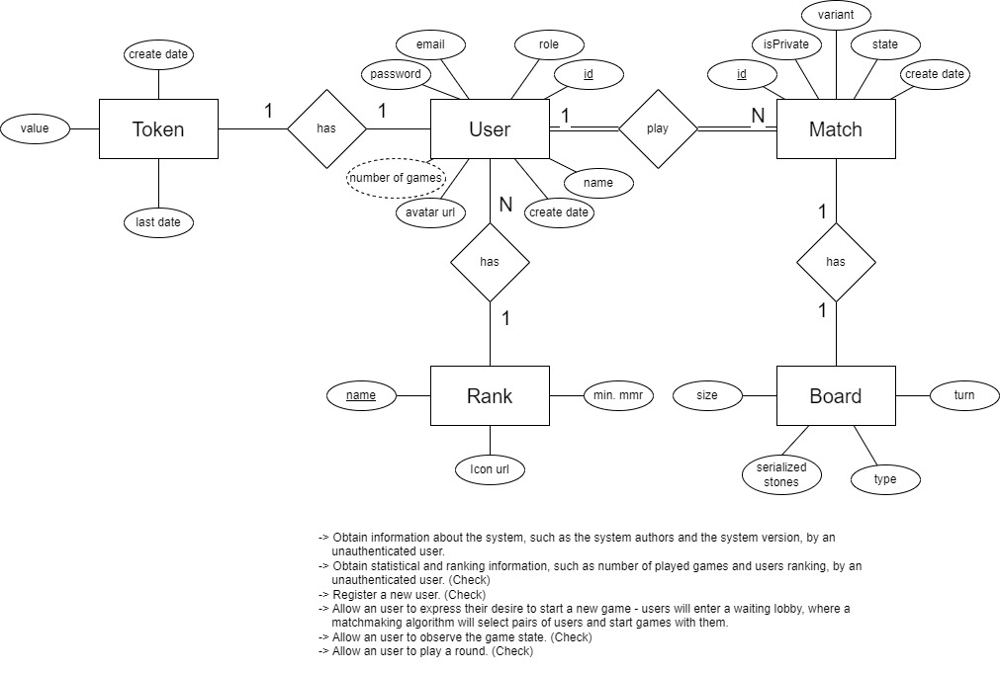
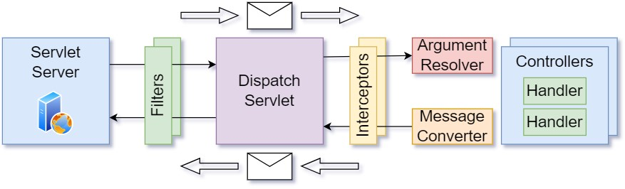

# DAW Project Phase 1
## Introduction
This document presents the design and implementation aspects of the DAW Project.  

## Modeling the Database
The database is modeled using 5 different tables:  
- `user` - Represents the users of the application.
- `token` - Represents the tokens of the application.
- `match` - Represents the matches of the application.
- `rank` - Represents the ranks of the application.
- `board` - Represents the boards of the application.

### Conceptual Model
The conceptual model of the database is represented in the following image:

This Diagram includes the EA Model and some of the constraints that are defined in the [Open-API](../docs/swagger/apiRoutes.yaml) specification.  

## Software Organization

### Open-API Specification
In our [Open-API](../docs/swagger/apiRoutes.yaml) specification, we highlight the following aspects:

- The endpoints are defined for managing users, tokens, matches, ranks and boards.
- The request and response formats are properly defined.
- The error responses are properly defined.
- The endpoints are grouped into logical groups.

### Request Details
When a request is received by the system, it goes through the following elements:

Using the `Spring Framework` and `Spring Boot`, the request is received by the `DispatcherServlet`.
The `DispatcherServlet` forwards the request to the `HandlerMapping`.
The `HandlerMapping` uses the `Open-API` specification to match the request URI to a route.
In this case, the request URI matches a route, the request is forwarded to the corresponding controller. 
If the request URI does not match any route, the request is forwarded to the `NotFoundController`.

In some cases, the request needs to have a `Bearer Token` in the `Authorization` header.

### Connection Management
In the class [GomukoApplication.kt](../src/main/kotlin/pt/isel/gomoku/server/GomokuApplication.kt) we define the bean `jdbi` that is used to manage the connection to the database.  
`val jdbiDatabaseURL = System.getenv("JDBI_DATABASE_URL")`
If we need to use the test database, we can set the environment variable `JDBI_DATABASE_URL` to `JDBI_TEST_DATABASE_URL`. 

### Data Access
The Repository layer is responsible for accessing the database.  
The explanation of the repository layer is in the [Repositories](#repositories) section.

### Module's division
The module's division, was made so each module is independent, reused and have easier maintenance throughout whole the project.  

IMAGE

### Error Handling/Processing
In the [Service](#services) layer, we have explained how the errors are handled.  
The class [CustomExceptionHandler.kt](../src/main/kotlin/pt/isel/gomoku/server/pipeline/CustomExceptionHandler.kt) is responsible for handling the errors.  
The class `CustomExceptionHandler` has the annotation `@RestControllerAdvice` that allows us to handle the exceptions in the whole application.  
The main objective is to convert the exceptions to the correct `Problem` response.  

### Project Architecture
TODO

## Domain
In the [Domain](../src/main/kotlin/pt/isel/gomoku/domain) package, we have the classes that represent the domain of the application.  
In other words, the classes that represent the model of the application game Gomoku.  
The logic of the game is implemented in the [Board](../src/main/kotlin/pt/isel/gomoku/domain/game/board/Board.kt) class.  

## Server
In the [Server](../src/main/kotlin/pt/isel/gomoku/server) package, we have the classes that represent the server of the application.  

### HTTP
In the [HTTP](../src/main/kotlin/pt/isel/gomoku/server/http) package, we have the classes that represent the usage of HTTP in the server.  

#### Controllers
In the [Controllers](../src/main/kotlin/pt/isel/gomoku/server/http/controllers) package, we have the classes that represent the controllers of the application.  
The controllers are responsible for validating the requests and sending the responses with the correct status code.  
The controllers used in the application are:
- [MatchController](../src/main/kotlin/pt/isel/gomoku/server/http/controllers/MatchController.kt) 
- [UserController](../src/main/kotlin/pt/isel/gomoku/server/http/controllers/UserController.kt)
- [SystemController](../src/main/kotlin/pt/isel/gomoku/server/http/controllers/SystemController.kt)

#### Model
In the [Model](../src/main/kotlin/pt/isel/gomoku/server/http/model) package, we have the classes that represent the model `DTO's` of the application.  
The `DTO's` are used to represent the data that is sent in the requests and responses.  
The DTO's used in the application are divided into:
- [Match](../src/main/kotlin/pt/isel/gomoku/server/http/model/match)
- [Problem](../src/main/kotlin/pt/isel/gomoku/server/http/model/problem)
- [User](../src/main/kotlin/pt/isel/gomoku/server/http/model/user)

### Pipeline
The [Pipeline](../src/main/kotlin/pt/isel/gomoku/server/pipeline) package, contains the classes that represent the pipeline of the application.  

The main objective of the pipeline is to validate the requests and send the responses 
The following image represents the pipeline of the application:

In the GomokuApplication.kt class, we define the bean `pipeline` that is used to manage the pipeline of the application.  
In this case, we register the interceptors and argument resolvers that are used in the pipeline.  

#### Authorization
The [Authorization](../src/main/kotlin/pt/isel/gomoku/server/pipeline/authorization) package, contains the classes that represent the authorization interceptor and argument resolver used in the application.  
Explaining the authorization with a deeper detail, we have the following chain of events:
- 1º The request is received by the `DispatcherServlet`.
- 2º The `DispatcherServlet` forwards the request to the `HandlerMapping`.
- 3º The `HandlerMapping` uses the `Open-API` specification to match the request URI to a route.
- 4º The request URI matches a route, the request is forwarded to the corresponding controller.
- 5º The request is intercepted by the `AuthorizationInterceptor`.
- 6º If the `prehandle` condition is met, in this case, having a parameterType of `AuthenticatedUser` the chain of events continues.
- 7º Inside the `prehandle` method, the `tokenProcessor` is used to process the `Bearer Token` in the `Authorization` header.
- 8º Finally, the Argument Resolver `AuthenticatedUserArgumentResolver` is used to resolve the `AuthenticatedUser` parameter.

Enhancing the fact, that is required the presence of a parameter of type `AuthenticatedUser` in the controller method, to be able to use the `AuthorizationInterceptor` and `AuthenticatedUserArgumentResolver`.  

### Repository
The [Repository](../src/main/kotlin/pt/isel/gomoku/server/repository) package, contains the classes that represent the repositories of the application.  
The repositories are responsible for accessing the database.

#### Interfaces
The [Interfaces](../src/main/kotlin/pt/isel/gomoku/server/repository/interfaces) package, contains the interfaces that represent the repositories of the application.  
The interfaces main objective is to define the methods that are used to access the database.  

#### Jdbi
The [Jdbi](../src/main/kotlin/pt/isel/gomoku/server/repository/jdbi) package, contains the classes that represent the jdbi repositories, mappers and statements of the application.  
The mappers, repositories and statements are inside this segment of the repository package, because they are used to access the database using the `Jdbi` library.  
Each one of them are responsible for a different task:  
- `Mappers` are responsible for mapping the database rows to the domain objects.  
- `Repositories` are responsible for accessing the database.  
- `Statements` are responsible for defining the queries that are used to access the database.

#### Transaction
The [Transaction](../src/main/kotlin/pt/isel/gomoku/server/repository/transaction) package, contains the classes that represent the transaction repositories of the application.  
The transaction repositories are responsible for accessing the database using the `Jdbi` library.  
The transaction repositories are used to execute multiple queries in the same transaction.  

### Service
The [Service](../src/main/kotlin/pt/isel/gomoku/server/service) package, contains the classes that represent the services of the application.  
The services are responsible for validating the requests captured by the controllers and sending the responses back to them.  
The `Service` layer contains the main services responsible to validate the requests and send the responses and the correspondent errors.  
So, depending on the sucess or failure of the request, the service will return the correspondent `Error` or `DTO`.  

## Testing
In the [Test](../src/test/kotlin/pt/isel/gomoku/server) package, we have the classes that represent the tests of the application.  
We have the following tests:
- [DomainTests](../src/test/kotlin/pt/isel/gomoku/domain) - Tests the domain of the application.
- [ServerTests](../src/test/kotlin/pt/isel/gomoku/server) - Tests the server of the application.

Inside the `ServerTests` package, we have the following tests:
- [ControllersTests](../src/test/kotlin/pt/isel/gomoku/server/controllers) - Tests the controllers of the application.
- [ServicesTests](../src/test/kotlin/pt/isel/gomoku/server/services) - Tests the services of the application.

## Critical Evaluation
In this project, we have used the `Spring Framework` and `Spring Boot` to develop the server of the application.  
The `Spring Framework` and `Spring Boot` are very powerful tools that allow us to develop the server of the application in a fast and efficient way.  
This phase of the project went well. However, there's always room for improvement.  
In the next phase of the project, we will try to improve the server/domain of the application.  
